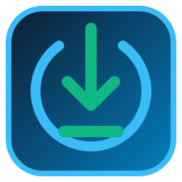

# ⚡ NightByte AI

<p align="center">
  
</p>

<p align="center">
  <b>The Smartest Open-Source Auto-Shutdown & Download Guardian for Windows</b>
</p>

<p align="center">
  <a href="https://github.com/Mayer-ELbot/NightByte/releases"></a>
  <a href="LICENSE"></a>
  
  
  
</p>

---

## 🌟 Overview

**NightByte AI** is a lightweight, intelligent desktop utility engineered to monitor downloads across **Steam, Epic Games, EA App, Battle.net, Xbox, Torrent clients, and IDM / Browsers**, and automatically perform power management actions (**Shutdown, Sleep, Hibernate, Restart, Lock Workstation, Turn off Displays**) once all downloads finish.

Unlike basic shutdown timers, **NightByte AI is context-aware**:
- 🛡️ **Internet Drop Protection (Network Guardian):** If your internet disconnects in the middle of the night, **NightByte freezes the shutdown timer** so your PC stays awake and resumes downloading when the connection is restored.
- 🎮 **Deep Steam & Launcher Parsing:** Reads `libraryfolders.vdf`, `appmanifest_*.acf` state flags, and staging directories so it never shuts down during game allocation, patching, or verification.
- 🎯 **Targeted Download Mode:** Choose between waiting for all downloads or selecting specific games/files to monitor.
- 🧠 **Anti-AFK & Gaming Mode:** If you are actively using your PC or playing a full-screen game, NightByte defers shutdown automatically.
- 🚨 **Floating Countdown HUD:** Minimalist on-screen warning window with instant 1-click **Cancel** and quick-snooze actions (`+5m`, `+15m`, `+30m`, `+1h`).
- 🔄 **Built-in GitHub Update Checker:** Automatically notifies you when a new release is available on GitHub.
- 🖤 **Monochrome Dark Aesthetic:** Distraction-free, high-contrast dark theme inspired by modern developer tools.

---

## 🚀 Key Features

| Feature | Description |
| :--- | :--- |
| **🛡️ Network Guardian** | Continuous async health ping. Automatically freezes shutdown countdown when internet drops to prevent corrupted/unfinished downloads. |
| **🎮 Multi-Platform Engine** | Deep detection for Steam, Epic Games, EA App, Battle.net, Xbox, Torrent clients (qBittorrent, etc.), IDM, and Browsers. |
| **🎯 Specific Game Targeting** | Interactive download cards allow selecting individual games to wait for rather than everything. |
| **📊 Real-Time Live Graph** | Smooth vector speed waveform, large hero speed display, disk write rate, session data received, and active items list. |
| **🧠 Anti-AFK & Awake Lock** | Keeps Windows awake during downloads (`SetThreadExecutionState`) and pauses action if user input is detected. |
| **🚨 Countdown Warning HUD** | Translucent floating circular countdown dialog with audio alerts and snooze controls. |
| **🔔 Discord / Telegram Webhooks** | Optional remote webhook notifications sent directly to your phone when downloads finish. |
| **📥 GitHub Release Updater** | Asynchronous version check with direct 1-click update download link. |
| **⚙️ System Tray Integration** | Minimize to tray, dynamic tooltip with live speed, and quick right-click menu. |

---

## 📥 Download & Quick Start

### Option 1: Standalone Portable Executable (No Python Required)
1. Download the latest **`NightByte.exe`** from [GitHub Releases](https://github.com/Mayer-ELbot/NightByte/releases).
2. Run **`NightByte.exe`** and start monitoring immediately.

### Option 2: Run from Source Code
```bash
# 1. Clone the repository
git clone https://github.com/Mayer-ELbot/NightByte.git
cd NightByte

# 2. Install dependencies
pip install -r requirements.txt

# 3. Run the application
python src/main.py
```

---

## 🛠️ Building the Standalone `.exe`

To compile the single-file Windows executable with embedded icons and assets:

```bash
python build.py
```
The compiled binary will be generated at `./NightByte.exe`.

---

## 📁 Project Architecture

```
NightByte/
├── assets/                 # App icons and graphics
│   ├── app_icon.ico
│   └── app_icon.png
├── src/
│   ├── core/               # Core intelligence & platform detectors
│   │   ├── launcher_detector.py
│   │   ├── monitor_engine.py
│   │   ├── network_guardian.py
│   │   ├── steam_detector.py
│   │   └── system_power.py
│   ├── gui/                # PySide6 GUI views & dialogs
│   │   ├── countdown_dialog.py
│   │   ├── main_window.py
│   │   ├── settings_dialog.py
│   │   ├── tray_manager.py
│   │   └── widgets/
│   │       ├── download_card.py
│   │       ├── platform_chip.py
│   │       └── speed_graph.py
│   ├── i18n/               # Localization & string tables
│   │   └── translations.py
│   ├── themes/             # Monochrome Dark Stylesheets
│   │   ├── styles.py
│   │   └── theme_manager.py
│   ├── utils/              # Config, logger, sound, updater
│   │   ├── config.py
│   │   ├── logger.py
│   │   ├── sound_effects.py
│   │   └── updater.py
│   └── main.py             # Application entry point
├── build.py                # Standalone PyInstaller builder
├── CHANGELOG.md            # Release history
├── CONTRIBUTING.md         # Open-source contribution guidelines
├── LICENSE                 # MIT License
├── requirements.txt        # Python dependencies
└── README.md               # Documentation
```

---

## 🤝 Contributing

Contributions, issues, and feature requests are welcome!
Feel free to check the [issues page](https://github.com/Mayer-ELbot/NightByte/issues).

1. Fork the Project
2. Create your Feature Branch (`git checkout -b feature/AmazingFeature`)
3. Commit your Changes (`git commit -m 'Add some AmazingFeature'`)
4. Push to the Branch (`git push origin feature/AmazingFeature`)
5. Open a Pull Request

---

## 🙏 Acknowledgements & Credits

- Inspired by the concept of [SteamDown](https://github.com/Avaneesh13/SteamDown) by [@Avaneesh13](https://github.com/Avaneesh13).
- Built independently from scratch with a completely new architecture, multi-platform engine, network guardian, and modern interface under the MIT License.

---

## 📄 License

Distributed under the **MIT License**. See `LICENSE` for more information.

---

<p align="center">
  Made with ❤️ for gamers & night downloaders worldwide.
</p>
